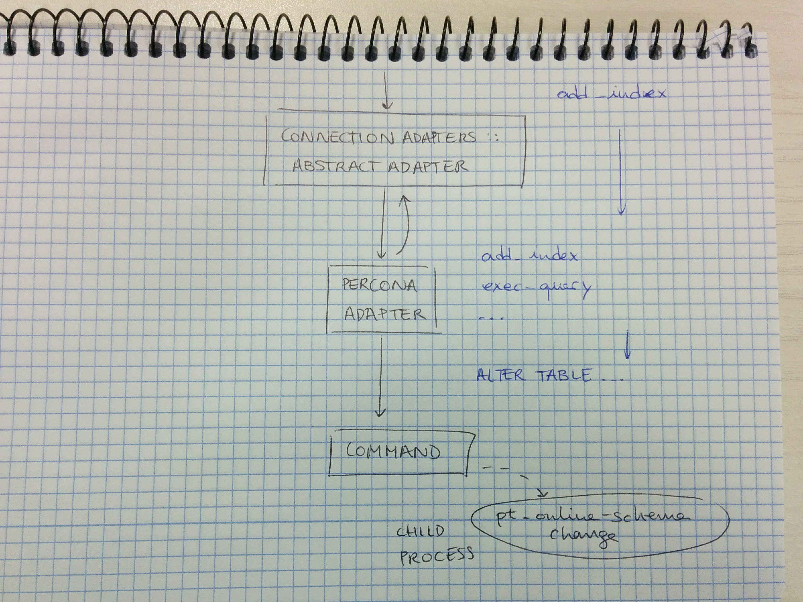

# [fit] **Percona Migrator**
# [fit] Active Record Adapter
# [fit] for online MySQL Migrations

---

**@prez\_pau**

Backend developer at Redbooth
_and doing stuff with relational databases_

---

# **What’s**
# [fit]**Percona Migrator?**

---

# :heart: to
# the _users_

——-

# **_to developers_**

---

# migrations for  apps but with _steroids_

---

# respectful with the database

---

# by default!

---

# *No need to learn a new DSL*

---

# **_to customers_**

---

# Does not affect the database’s functioning

---

# ~~downtime~~

---

# [fit]**How does it do that?**

---

# **from the folks at Percona**
# `pt-online-schema-change`

---

---

---

---

# **With**
# dynamic copy chunks
# replica lag monitoring
# load monitoring
# ...

---

# **The glue:**
# [fit]**An ActiveRecord**
# [fit]**connection adapter**

---

---

---

---

# [fit]**OK, but show me**

---

---

# [fit]**Breaking news!**

---

# [fit]**Breaking news!**
# [fit]**There will be a rename**

---

# departure?
# some migrating animal?
# _stork, caribou, etc._

---

# _bird, db\_bird,_
# _angry\_bird, paharoo?_

---

# **please, help us!**
# [redbooth/percona_migrator](https://github.com/redbooth/percona_migrator)
# `issues/43`

---

# **Do you want to know more?**
# [blog post](https://hackernoon.com/percona-migrator-announcement-6a32d5b7484c#.85thqscsn)

---

# **Q&A**
